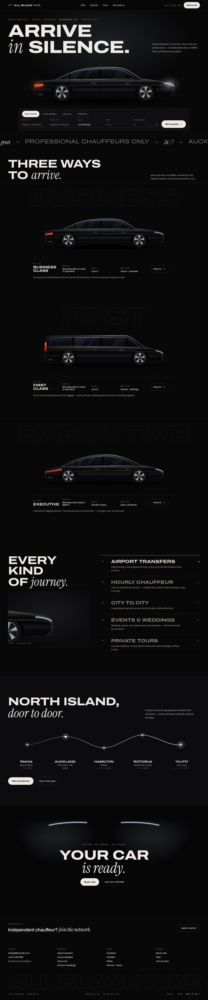
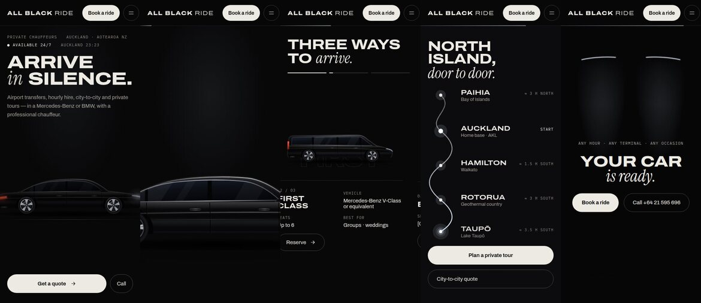

# All BlackRide — homepage redesign (demo)

Concept redesign of [allblackride.com](https://allblackride.com/), a private chauffeur service in Auckland, NZ.
Dark, image-led and premium, with the scroll-driven motion built into the page.

**Live canvas:** https://claude.ai/artifact/Hbi6yWQ4unE3K9mLw7nGui
To see the motion, open the *Homepage* board full-window and scroll.

## What's in this folder

| Path | Contents |
|---|---|
| `design/Main.dc.html` | The homepage. Fluid layout from 1440 px down to phone width. |
| `design/Mobile.dc.html` | The same page in a 390 px frame, so the canvas shows the phone layout. Generated from the same source. |
| `design/Motion*.dc.html` | Five standalone motion studies with a scrub slider. These are reference boards; all five are also built into the homepage. |
| `design/canvas.json` | Canvas layout: board positions, sizes and titles. |
| `assets/` | Car artwork (SVG): body, separate wheel, light-sweep mask per model, plus a film-grain texture. `blob-map.json` maps each `/_blob/<id>` URL used in the designs to its file here. |
| `tools/` | Generators. `gen_cars.py` draws the cars; `gen_homepage.py` and `gen_motion_studies.py` write the `.dc.html` files into `design/`. |
| `previews/` | Screenshots: full desktop and mobile pages, scroll frames for each motion sequence, and the five studies. |

The `.dc.html` files are Claude Design canvas components. They load the canvas runtime (`support.js`) and reference
assets by `/_blob/` URL, so they won't run as plain HTML when opened straight from disk. Use them as the design
source and spec. A production build would port the same markup and CSS to the site's own stack.

## Scroll motion system

Each section sets one CSS variable, `--p`, between 0 and 1. A small scroll handler writes it, and everything else is
`calc()` in CSS. In a real browser window, pinned sections pin on desktop and on phones. On the canvas they show a
fixed rest state, so nothing is ever hidden behind an animation.

| Section | Motion | Pinned for |
|---|---|---|
| Hero | **01 Light sweep:** the car starts dim and a band of light runs nose to tail. **02 Through the glass:** the camera pushes into the rear side window, then the screen shows "Step inside." | 320vh |
| Fleet | **03 Drive-by:** S-Class, then V-Class, then EQS cross the screen, wheels turning with scroll. The outlined class name moves at a parallax speed behind each car. | 360vh |
| Services | Rows fade in one after another. Hovering a row switches the close-up crop on the left. | — |
| Tours | **04 Route draw:** the headline reveals line by line, a car marker travels Paihia → Taupō, and each stop lights up as it's reached. | 250vh |
| Final call to action | **05 Headlight wake:** two headlights switch on, the beams open, then the call to action appears. | 200vh |

### On phones (860 px and below)

Every sequence above still runs on phones. Each is recomposed for a narrow screen rather than switched off.

| Section | On phones |
|---|---|
| Hero | Pinned (250vh). The car bleeds past the screen edge and the same light sweep and push through the glass play. The booking form is replaced by **Get a quote** and **Call** buttons. |
| Booking | A full form in its own block straight after the hero (`#book-m`). All "Book" links point to it on phones. |
| Fleet | Pinned (300vh) horizontal drive-by, one car per screen, with specs in two columns. |
| Services | The close-up image sticks under the header while the list scrolls beneath it. The row nearest the middle of the screen selects the close-up, since phones have no hover. |
| Tours | Pinned (230vh) **vertical** road. The route draws downward, the marker travels the road, and each stop lights up. |
| Final call to action | Pinned (170vh) headlight wake. |

Phone heights use `svh`, so the browser's address bar showing and hiding doesn't make pinned scenes jump. The page
also has a viewport meta tag. Without it, phones would render the desktop layout zoomed out.

Also included:
- **Page load:** a one-time intro (headline rise, car fade-in, lights flicker on).
- **Nav:** a scroll-progress line under the header and an active-section indicator.
- **Mobile menu:** full-screen, opens and closes.
- **Booking form:** tabs and a confirmation state on submit.
- **Live clock:** shows the current Auckland time.
- **Accessibility:** support for reduced-motion settings, visible keyboard focus, and text contrast of 4.5:1 or higher.

## Type and colour

- Display: Archivo at 125% width. Accent: Instrument Serif Italic. Labels: IBM Plex Mono. All are Google Fonts.
- Ground `#070708`, text `#EDEAE4`, secondary text `#A39E96` and `#8E8A83`, light accent `#DCE7FF`, tail-light red `#FF4A36`.

## Open items

- Executive class seat count is a placeholder, `[Confirm seats]`. The current site says 6, which an EQS or i7 doesn't seat.
- Drive times on the Tours route are approximate.
- The booking form only shows a confirmation; it isn't connected to anything. It needs to be wired to dispatch (email, WhatsApp or a booking system).
- The Privacy and Terms links have no pages behind them yet.
- The cars are vector illustrations. Real night-time photography of the client's own cars, cut out and layered the same
  way (body, separate wheels, light-sweep mask), is the biggest remaining upgrade.
